# ☁️ CloudVault Eclipse

> **Secure Cloud Document Management System on AWS with Amazon S3**

CloudVault Eclipse is a secure cloud-based document management system developed using **Python Flask** and **Amazon AWS S3**. It enables users to securely upload, organize, download, and manage documents in the cloud while providing robust authentication, email OTP verification, role-based access control, and an administrative dashboard.

---

# 📖 Table of Contents

- Project Overview
- Features
- System Architecture
- Screenshots
- Technology Stack
- Project Structure
- AWS S3 Integration
- Docker Deployment
- Installation
- Environment Variables
- Future Enhancements
- Developer

---

# 🚀 Project Overview

CloudVault Eclipse is designed to provide a secure and scalable platform for cloud document management.

The system allows authenticated users to:

- Register using Email OTP Verification
- Upload documents securely to AWS S3
- Download documents
- Delete documents
- Organize documents by category
- Search documents
- Manage personal profiles
- Change passwords
- Access an Admin Dashboard (Admin users)

The project demonstrates modern cloud application development using Flask, Docker, and AWS services.

---

# ✨ Features

## 👤 User Features

- User Registration
- Secure Login
- Email OTP Verification
- Password Hashing
- Profile Management
- Change Password
- Logout

---

## ☁ Document Management

- Upload Documents
- Download Documents
- Delete Documents
- Search Documents
- Category Filtering
- Cloud Storage using AWS S3
- Metadata stored in SQLite

---

## 🛡 Security

- Secure Password Hashing
- Session Authentication
- Email OTP Verification
- Role-Based Access Control
- Protected File Access
- Secure AWS S3 Storage

---

## 👨‍💼 Admin Features

- View Total Users
- View Total Documents
- Storage Statistics
- Today's Upload Count
- Promote Users to Admin
- Delete Users

---

# 🏗 System Architecture


---

# 📷 Application Screenshots

## 🏠 Landing Page

The homepage introducing CloudVault Eclipse and its key features.

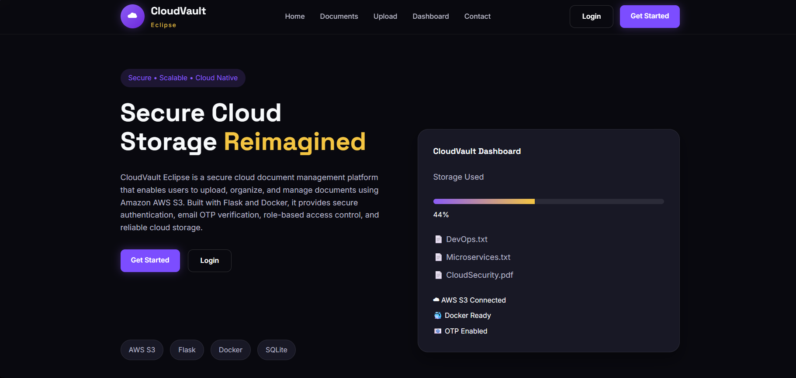

---

## 👤 User Registration

Create a new account with secure registration.

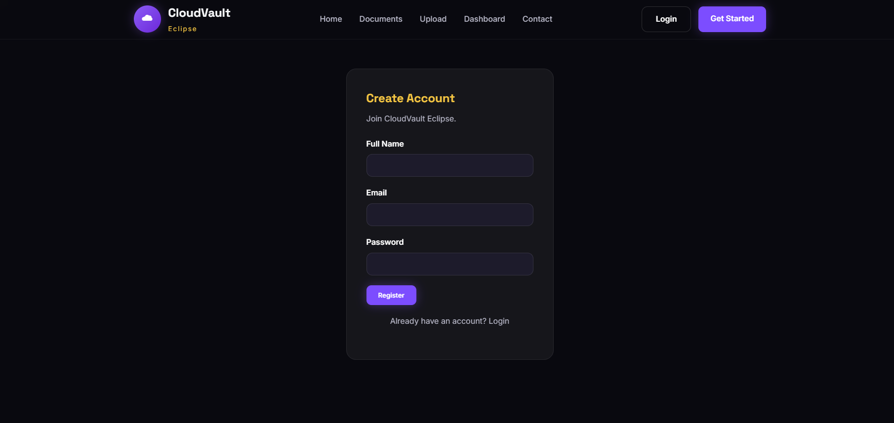

---

## 📧 Email OTP Verification

Verify your email address using the OTP sent via SMTP.

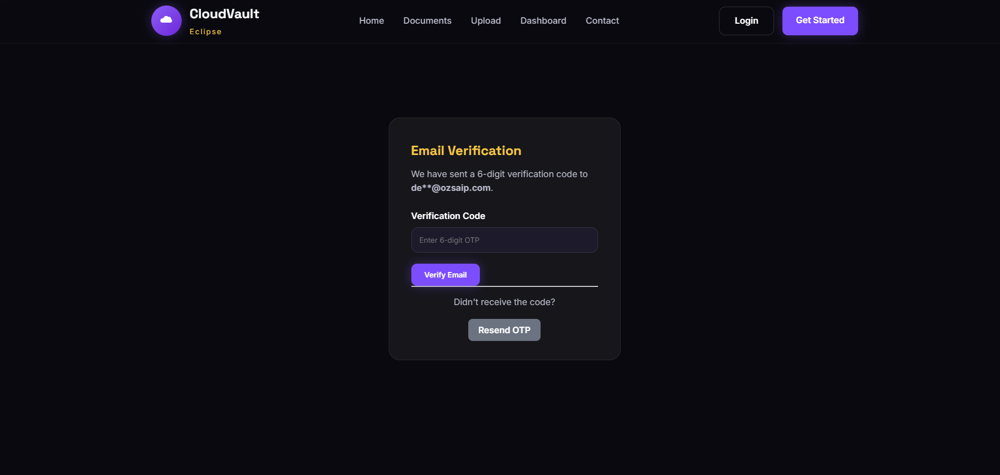

---

## 🔐 User Login

Secure login using registered credentials.

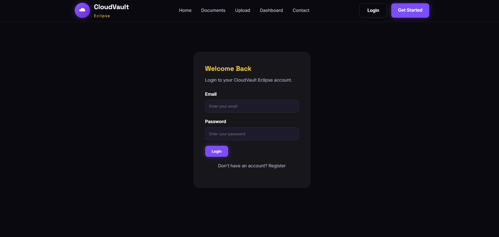

---

# 👤 User Module

## 📊 User Dashboard

Overview of uploaded documents, storage usage, and quick navigation.

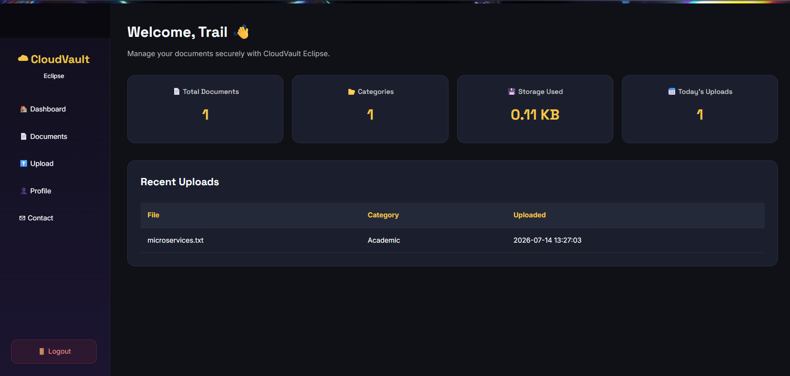

---

## ☁ Upload Document

Upload files directly to Amazon AWS S3.

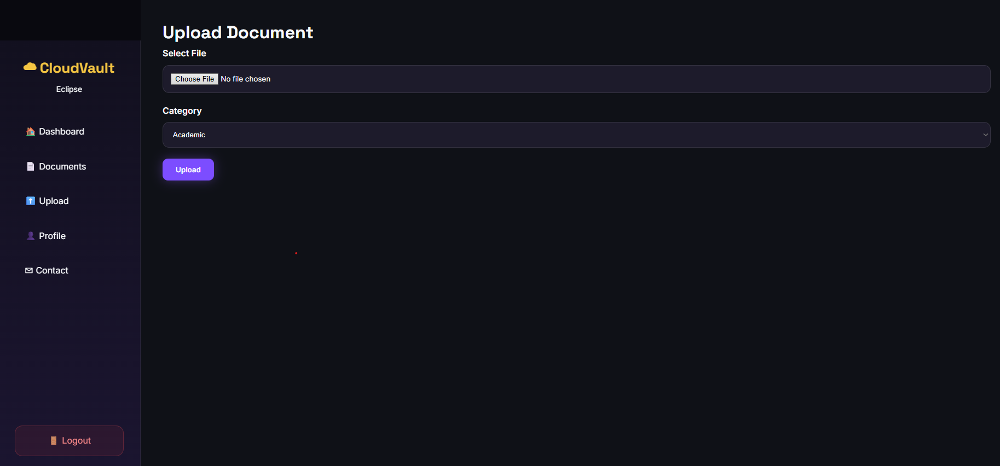

---

## 📄 My Documents

View, download, search, filter, and delete uploaded documents.

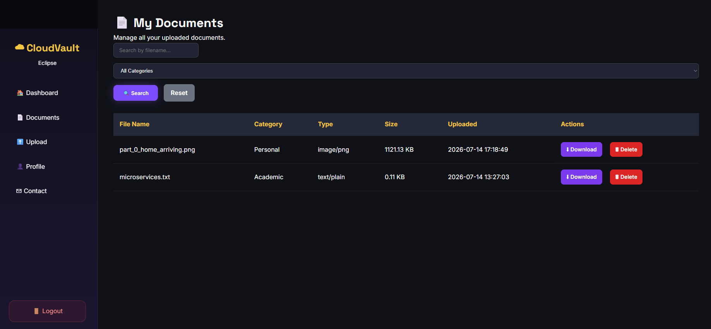

---

## 🔍 Search Documents

Search documents by filename and category.

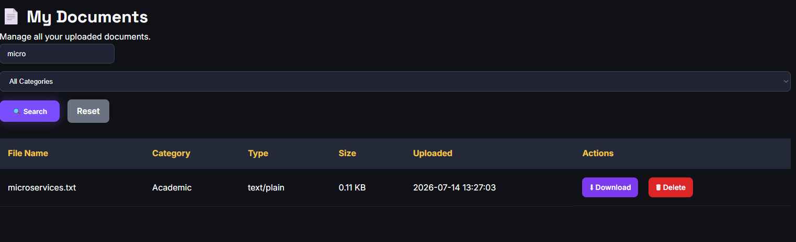

---

## 👤 Profile

View account details and personal information.

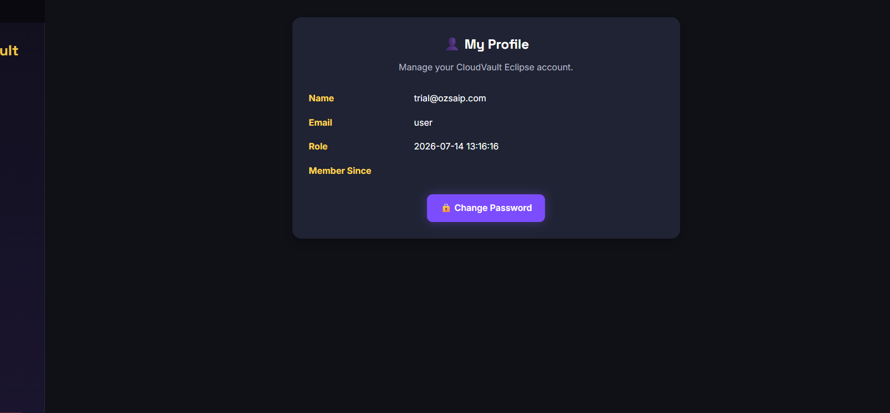

---

## 🔒 Change Password

Secure password update page.

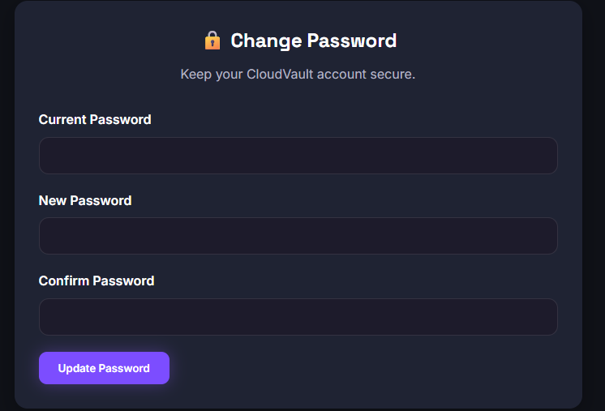

---

# 👨‍💼 Admin Module

## 👥 User Management

View all registered users.

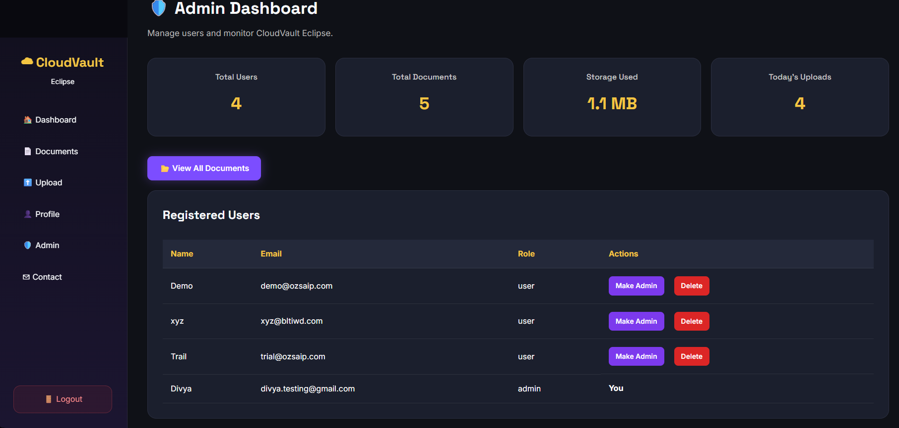

---

## ⭐ Promote User to Admin

Grant administrator privileges to users.


---

## 🗑 Delete User

Remove users securely from the system.


---

# ☁ AWS Cloud Storage

## Amazon AWS S3 Bucket

Uploaded documents stored securely inside Amazon S3.

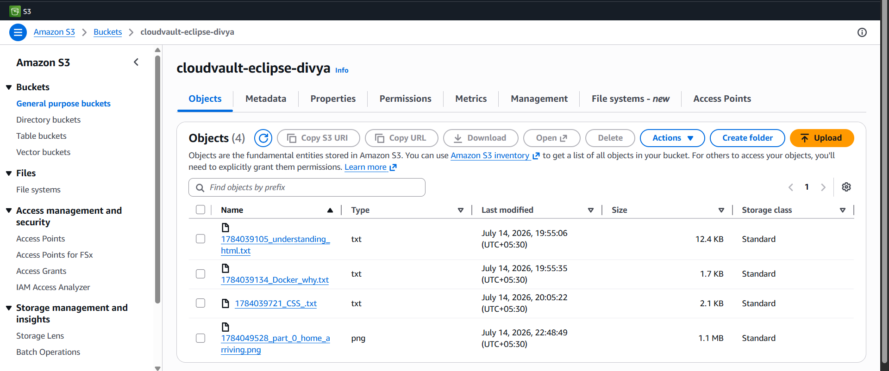

---

# 🐳 Docker Deployment

## Docker Container

CloudVault Eclipse running inside Docker.

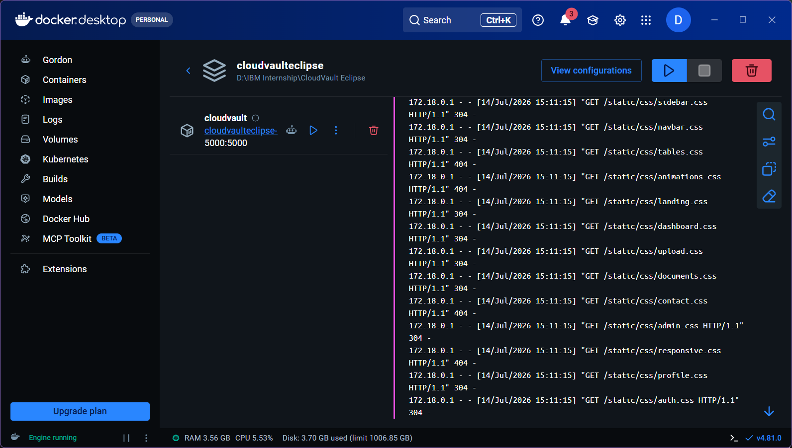

---

## 📞 Contact Page

Users can reach the CloudVault Eclipse team through the contact page.

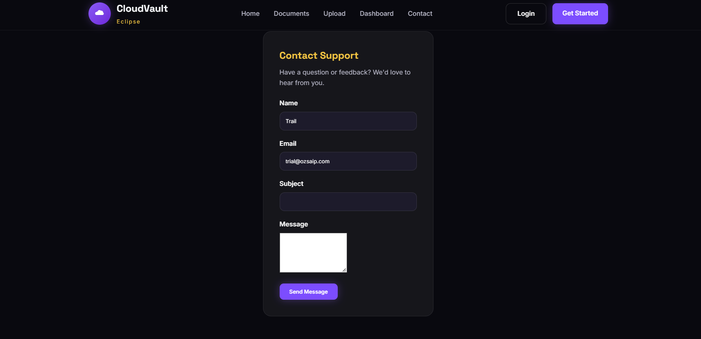

---

# 🛠 Technology Stack

| Technology    | Purpose                   |
| ------------- | ------------------------- |
| Python        | Backend Programming       |
| Flask         | Web Framework             |
| HTML5         | Frontend                  |
| CSS3          | Styling                   |
| JavaScript    | Client-side Functionality |
| SQLite        | Database                  |
| Amazon AWS S3 | Cloud Storage             |
| Docker        | Containerization          |
| SMTP          | Email OTP Verification    |
| Git           | Version Control           |
| GitHub        | Source Code Repository    |

---

# 📂 Project Structure

```
CloudVault Eclipse/
│
├── app.py
├── database/
├── static/
├── templates/
├── screenshots/
├── .github/
├── Dockerfile
├── docker-compose.yml
├── requirements.txt
├── README.md
└── .env.example
```

---

# ☁ AWS S3 Integration

CloudVault Eclipse stores uploaded documents securely in an Amazon AWS S3 bucket.

### Database stores only:

- File Name
- File Size
- File Type
- Category
- Upload Date
- S3 Object Key

The actual document files remain securely stored in AWS S3.

---

# 🐳 Docker

Build the application

```bash
docker compose build
```

Run the application

```bash
docker compose up
```

Application URL

```
http://localhost:5000
```

---

# ⚙ Installation

Clone the repository

```bash
git clone https://github.com/Celestial-tech100/CloudVault-Eclipse.git
```

Move into project

```bash
cd CloudVault-Eclipse
```

Create virtual environment

```bash
python -m venv venv
```

Activate environment

### Windows

```bash
venv\Scripts\activate
```

### Linux / macOS

```bash
source venv/bin/activate
```

Install dependencies

```bash
pip install -r requirements.txt
```

Run application

```bash
python app.py
```

---

# 🔑 Environment Variables

Create a `.env` file:

```env
SECRET_KEY=your_secret_key

EMAIL_USER=your_email@example.com
EMAIL_PASSWORD=your_email_password

AWS_ACCESS_KEY_ID=your_access_key
AWS_SECRET_ACCESS_KEY=your_secret_key
AWS_BUCKET_NAME=your_bucket_name
AWS_REGION=your_region
```

---

# 📈 Project Highlights

- Secure Cloud Storage
- AWS S3 Integration
- Docker Containerization
- Email OTP Authentication
- Role-Based Access Control
- Responsive User Interface
- Admin Dashboard
- Search & Filter Documents
- Secure File Downloads
- Cloud-Native Architecture

---

# 🔮 Future Enhancements

- PostgreSQL Database
- File Sharing
- Document Versioning
- Multi-Factor Authentication (MFA)
- Activity Logs
- File Preview
- Storage Analytics
- AI-Based Document Classification

---

# 👨‍💻 Developer

**CloudVault Eclipse**

Developed as part of the **IBM SkillsBuild Internship Project**.

**Developer:** Celestial-tech100
**Name:** Divya H Kishore

Year: **2026**

---

# ⭐ If you like this project

Give this repository a ⭐ on GitHub.
